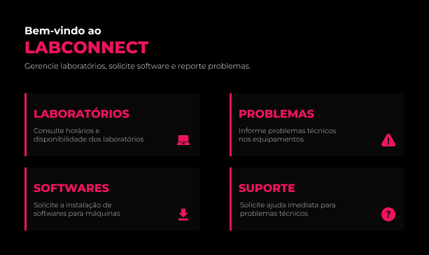
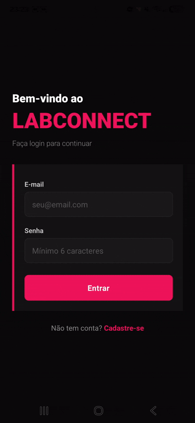

# LabConnect
> Aplicativo mobile de gerenciamento de laboratórios e suporte técnico para instituições de ensino.

<p align="center">
  
</p>

---

## Sobre o Projeto
O **LabConnect** é um aplicativo mobile desenvolvido em **React Native com Expo**, voltado para o ambiente acadêmico de uma faculdade de tecnologia. Ele centraliza em um único lugar a consulta de laboratórios, solicitação de instalação de softwares, reporte de problemas técnicos e chamada de suporte presencial.

### Qual problema ele resolve?

Em ambientes acadêmicos com múltiplos laboratórios e equipamentos, professores e técnicos frequentemente enfrentam dificuldades para:

- Saber quais laboratórios estão disponíveis e em quais horários;
- Solicitar a instalação de softwares específicos para uma turma;
- Reportar problemas técnicos nos equipamentos de forma ágil;
- Chamar suporte presencial sem precisar ligar ou se deslocar até a TI.

### Funcionalidades Implementadas

| Tela | Funcionalidade |
|---|---|
| **Home** | Menu principal com acesso às 4 seções do app |
| **Laboratórios** | Listagem de 4 labs com status de disponibilidade e agenda semanal completa |
| **Softwares** | Solicitação de instalação com formulário, listagem de pedidos e badges de status |
| **Problemas** | Reporte de problemas técnicos em equipamentos com histórico de chamados |
| **Suporte** | Chamada de técnico presencial diretamente para a sala do professor |

---

## Integrantes do Grupo

Projeto desenvolvido individualmente.

| Nome | RM |
|---|---|
| *Luana Magalhães Freire* | *565305* |

---

## Como Rodar o Projeto

### Pré-requisitos

Certifique-se de ter instalado na sua máquina:

- [Node.js](https://nodejs.org/) (versão 18 ou superior)
- [Expo CLI](https://docs.expo.dev/get-started/installation/)
- Aplicativo **Expo Go** no celular ([Android](https://play.google.com/store/apps/details?id=host.exp.exponent) / [iOS](https://apps.apple.com/app/expo-go/id982107779)) **ou** Android Studio com emulador configurado

### Passo a Passo

**1. Clone o repositório**
```bash
git clone https://github.com/Iuanamagalhaes/fiap-cpad-cp1-app-labconnect
cd labconnect
```

**2. Instale as dependências**
```bash
npm install
```

**3. Inicie o projeto**
```bash
npx expo start
```

**4. Rode no dispositivo**

- **Celular físico:** Abra o Expo Go e escaneie o QR Code exibido no terminal.
- **Emulador Android:** Pressione `a` no terminal após o Expo iniciar.

---

## Demonstração

### Vídeo do App em Funcionamento

<p align="center">
  
</p>

---

## Decisões Técnicas

### Estrutura do Projeto

```
labconnect/
├── app/                    # Rotas do Expo Router
│   ├── (auth)/
│   │   ├── login.jsx       # Tela de login
│   │   └── cadastro.jsx    # Tela de cadastro
│   ├── _layout.js          # Layout raiz com providers e guarda de rota
│   ├── index.js            # Home (protegida)
│   ├── laboratorios.js     # Tela de laboratórios (protegida)
│   ├── softwares.js        # Tela de softwares (protegida)
│   ├── problemas.js        # Tela de problemas (protegida)
│   └── suporte.js          # Tela de suporte (protegida)
├── components/             # Componentes reutilizáveis
│   ├── Botao.jsx           # Botão com loading/disabled/variantes
│   ├── Entrada.jsx         # Input com label, erro inline e shake
│   ├── Notificacao.jsx     # Feedback animado de sucesso/erro
│   ├── BarraDePesquisa.jsx # Campo de busca em tempo real
│   ├── BarraDeBusca.jsx    # Campo de pesquisa simples com atualização dinâmica de texto
│   └── ListaVazia.jsx      # Tela de lista vazia
├── context/
│   ├── ContextoAuth.jsx    # Estado global de autenticação
│   └── ContextoDadosApp.jsx  # Estado global de softwares e problemas
├── hooks/
│   └── useValidacao.js     # Hook de validação de formulários
├── constants/
│   └── cores.js            # Paleta de cores centralizada
└── assets/
```

### Contexts criados

**AuthContext**  
Gerencia: `user` (objeto com nome e e-mail), `loading` (booleano para splash), `login()`, `logout()`, `register()`.  
Persistência: usuários salvos em `@labconnect:users`, sessão ativa em `@labconnect:session`.

**AppDataContext**  
Gerencia: listas de `softwares` e `problemas`, funções `addSoftware()` e `addProblema()`, flags de loading.  
Persistência: `@labconnect:softwares` e `@labconnect:problemas`.

### Como a autenticação foi implementada

1. `AuthProvider` envolve toda a árvore em `_layout.js`
2. O hook `useEffect` no `RootLayoutNav` monitora `user` e `segments`
3. Usuário não logado tentando acessar qualquer rota fora de `(auth)` é redirecionado para `/login`
4. Usuário logado tentando acessar `(auth)` é redirecionado para `/`
5. Durante a leitura inicial do AsyncStorage, exibe `ActivityIndicator`

### AsyncStorage — chaves utilizadas

| Chave | Conteúdo |
|---|---|
| `@labconnect:users` | Array de objetos `{ nome, email, senha }` |
| `@labconnect:session` | Objeto `{ nome, email }` do usuário logado |
| `@labconnect:softwares` | Array de solicitações de software |
| `@labconnect:problemas` | Array de problemas reportados |

### Navegação protegida

Implementada diretamente no `_layout.js` via `useSegments()` + `useEffect()`. Não depende de middlewares externos — a lógica verifica se o segmento atual pertence ao grupo `(auth)` e redireciona conforme o estado de autenticação.


---

## f) Diferencial Implementado — Busca e Filtragem em Tempo Real

**Diferencial escolhido:** Busca e filtragem em tempo real com FlatList

**Justificativa:**  
À medida que o número de solicitações de software e problemas cresce, localizar um item específico numa lista estática se torna trabalhoso. A busca em tempo real resolve isso de forma imediata e sem fricção — o usuário digita qualquer trecho do nome, sala ou status e a lista se filtra instantaneamente, sem precisar confirmar com um botão. Isso agrega valor real ao fluxo de trabalho dos técnicos que precisam verificar o status de chamados rapidamente.

**Como foi implementado:**

- Componente `SearchBar` reutilizável em `components/SearchBar.jsx`
- Estado `busca` local em cada tela que usa filtragem
- `listaFiltrada` calculada como derivação do array completo usando `.filter()` com `toLowerCase().includes()`
- A busca cobre múltiplos campos simultaneamente (nome, sala, status, descrição)
- `FlatList` substitui `ScrollView` estático, com suporte nativo a `ListHeaderComponent`, `ListEmptyComponent` e performance otimizada para listas longas
- Contador `"X de Y resultado(s)"` fornece feedback visual imediato sobre o estado da busca
- Componente `EmptyList` exibe mensagem contextual diferente para "lista vazia" vs. "sem resultados para a busca"

### Como a Navegação foi Organizada

A navegação foi construída com **expo-router** em modo `Stack`, configurado no `_layout.js` com `headerShown: false` para que cada tela gerencie seu próprio cabeçalho visualmente.

- A **Home** (`index.js`) é o ponto de entrada e usa `router.push('/nome-da-tela')` para navegar para cada seção.
- Cada tela interna tem um botão "Voltar" estilizado que chama `router.back()`, retornando à Home.
- O fluxo de navegação é linear: **Home → Tela → Home**.